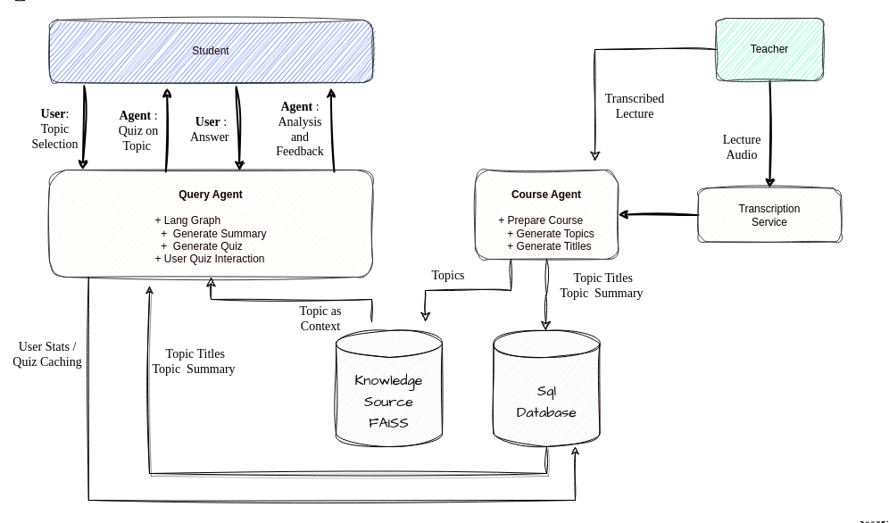

Here's a suggested README.md file for the `mind-engage-backend` repository. This file outlines the setup, usage, and contribution guidelines for the backend part of the MindEngage project, built using Flask.


# MindEngage Backend

## Introduction
MindEngage Backend serves as the server-side application for the MindEngage educational platform. It is built using Flask and is designed to handle API requests, session management, and dynamic content delivery powered by NVIDIA's NIM Generative AI and LangGraph knowledge query pipelines.

## Features
- API endpoints for quizzes, session management, and user interactions
- Integration with NVIDIA's NIM Generative AI for dynamic quiz generation
- Utilization of LangGraph for structured knowledge querying
- Session management and logging of user performance stats

## Architecture Overview

## Getting Started

### Prerequisites
- Python 3.8 or newer
- Flask
- Virtual environment (Conda recommended)

### Installation
1. Clone the repository:
```bash
git clone https://github.com/mind-engage/mind-engage-backend.git
```
2. Navigate to the project directory:
```bash
cd mind-engage-backend
```
3. Create a virtual environment:

```
conda create --name myenv python=3.10
```
4. Activate the Conda environment
```
conda activate myenv
```

5. Install required packages
```
pip install -r requirements.txt
```

## Usage
To start the Query Agent server:
```bash
python agents/query_server.py
```
This will start the Flask server on `http://localhost:8080`. The API can now respond to requests from the mobile front-end.

To start the Course Agent server:
```bash
python agents/course_server.py
```
This will start the Flask server on `http://localhost:5000`. The API can now respond to requests from the mobile front-end.


## Contributing
We welcome contributions from everyone. To contribute:
1. Fork the repository.
2. Create your feature branch (`git checkout -b feature/YourFeature`).
3. Commit your changes (`git commit -m 'Add some YourFeature'`).
4. Push to the branch (`git push origin feature/YourFeature`).
5. Open a Pull Request.

## License
This project is licensed under the MIT License - see the `LICENSE` file for details.

## Contact
- Project Link: [https://github.com/mind-engage/mind-engage-backend](https://github.com/mind-engage/mind-engage-backend)

## Acknowledgments
- NVIDIA for NIM Generative AI Inference
- LangGraph knowledge pipeline
- All contributors who have helped develop and maintain this project.
